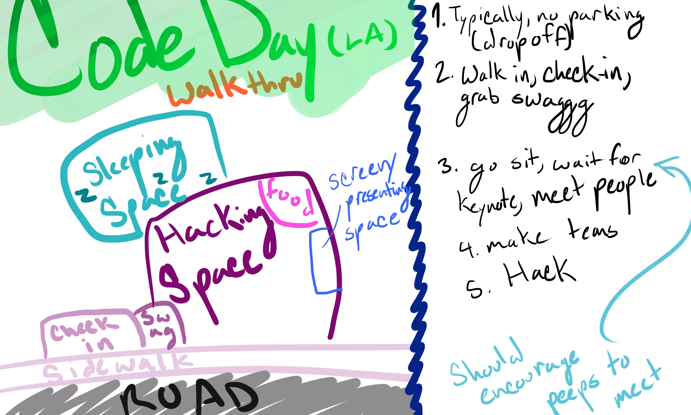

Actionable Items:
- Zach
	- Reach out to 5 venues
	- Reach out to having Ashton Kutcher judge February hackathon
- Gemma
	- Reach out to 5 sponsors
	- Drop by the LA Makerspace and talk to people
- Ben
	- Start planning menu
	- Markdownify

Values:
- Radically Beginner Friendly
- Radical Customer Contentment
- Safety
	- Celebrate Failure!
	- Celebrating Discovery
- Mutual Improvement
	- Discovery
- Radical Absurdity
	- Ludum Dare

Walkthrough:
- When you first start hearing about it
	- Two spectrums
		- Never been before
			- No clue what to expect
			- When you hear about it, "what a hackathon is" is explained to you.
				- Hackathon culture
				- Learning environment
				- Doing a lot more than just coding
		- Been before
			- Know the hype
			- Know the awesome
			- Rep your city
- In the emails you see pictures of people having fun at CodeDay.
- Maybe play a game before CodeDay about
	- the venue or something
	- making a game
		- a meta-game
	- whoever can make the best codeday slogan wins
- You show up to CodeDay, there's not parking
- You walk in and register
- There are mascots being super available
	- We want to be super welcoming
	- Like Dave Fontenot, but for StudentRND.
- There are board games on every table
	- Connect Four
	- Jenga
	- Cames
		- A game that the German guys taught Ben
		- It's about finding your partner without signalling your partner
	- Wii
	- Smash
	- Jenga tournament with random shit that's not Jenga blocks
	- Pasta + marshmallow, build the highest tower

Food (Ben):
- Avacodos
	- how to make guacamole
- Chips and beans

JUDGES:
- Sam Stokes - Microsoft
- Mayor Garcetti - ruler of the Angelinos
- Peter Marx - Chief of Tech
- Rob Witoff - JPLer
